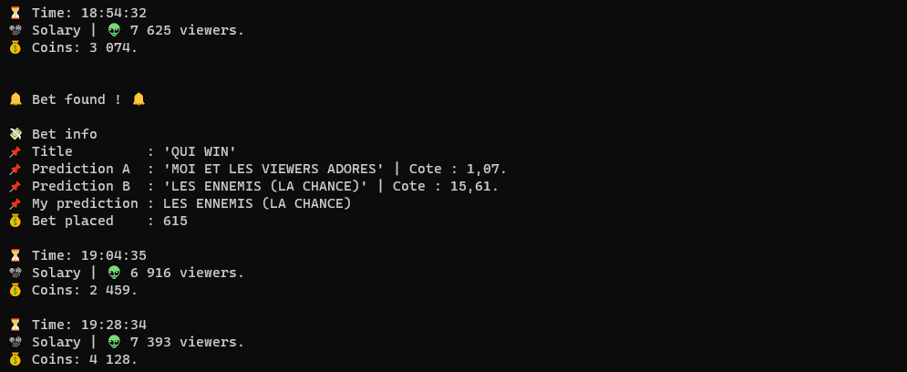

<h1 align="center">

   

  
   
  Twitch AFK
   
</h1>

<h4 align="center">An AFK bot for <a href="https://www.twitch.tv" target="_blank">Twitch</a> that auto collect channel points & auto bet.</h4>

 Version <a href="version">EARLY-ALPHA</a>

 

 [][ChangeLog] [][ChangeLog]

<!-- TOC -->

  <a href="#table">Installation & use</a> <!-- • -->

<!-- omit in toc -->
## 

## Installation & use

1) `git clone git@github.com:ClementRoyer/TwitchAFK.git`
2) `pip3 install -r requirement.txt`
3) update the *config.txt* with your infos
   - You can find your token on twitch cookies.
4) run : `python3 poc.py`

<!-- footer -->

<!-- omit in toc -->
#

 
   <b>Please feel free to contribute ❤︎</b>
  

[][Policy] [][twitter] [][Linkedin] 

<!-- omit in toc -->
# 

:-black.svg?style=flat&logoColor=white&labelColor=gray&color=gray) 

<!-- links -->
[Main-Readme]: .
[Policy]: ./LICENSE
[Postman-Doc]: .
[ChangeLog]: .
[Twitter]: https://www.twitter.com/ciemrnt
[Linkedin]: https://www.linkedin.com/in/cl%C3%A9ment-royer/